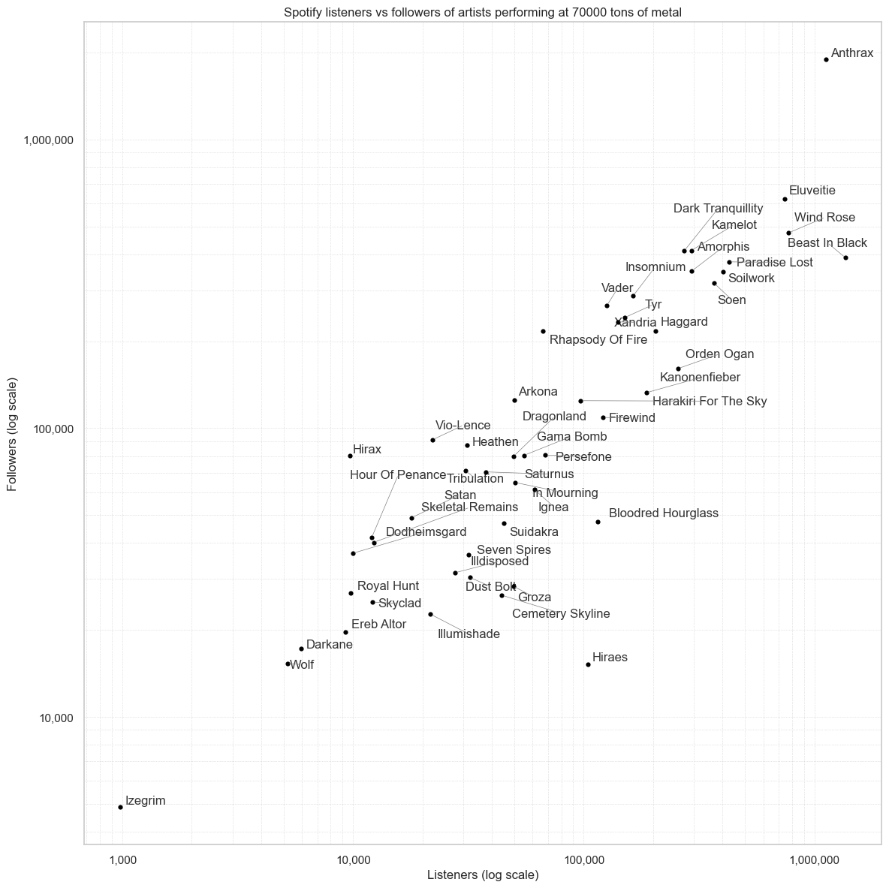
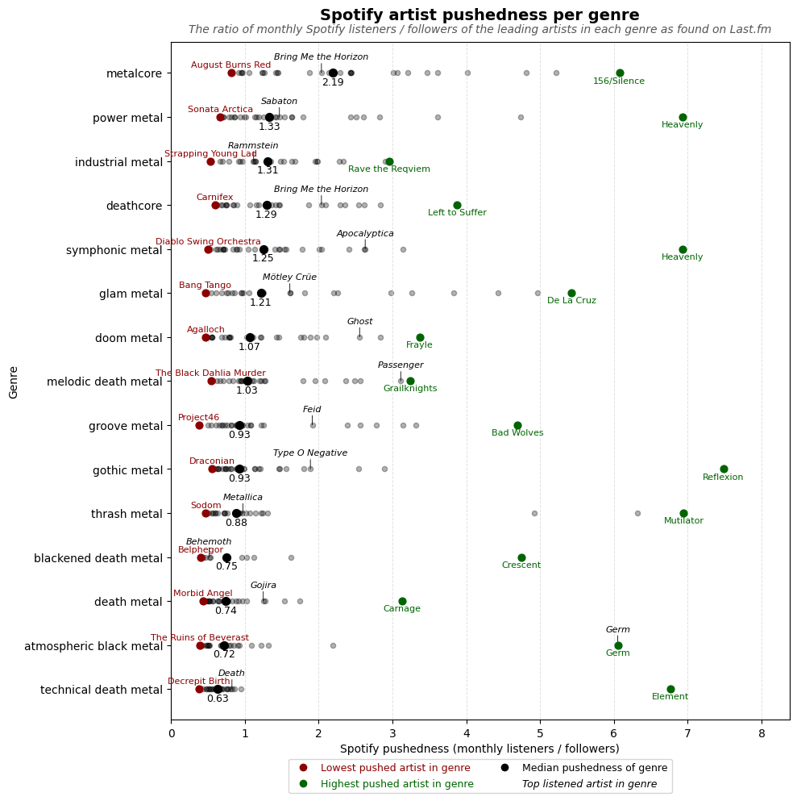
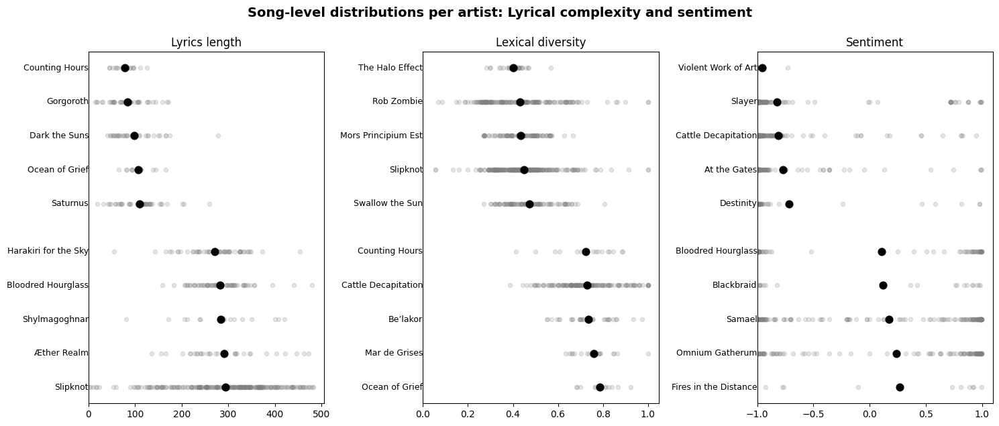
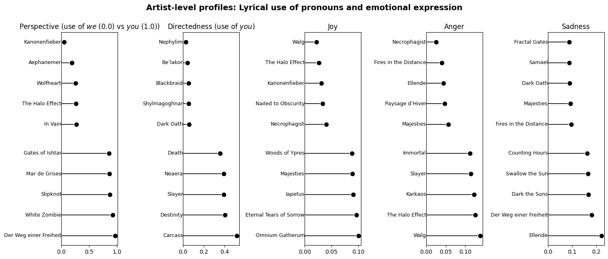
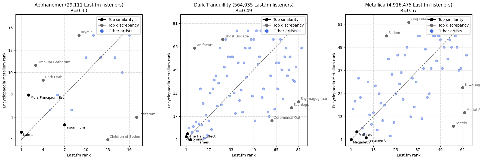
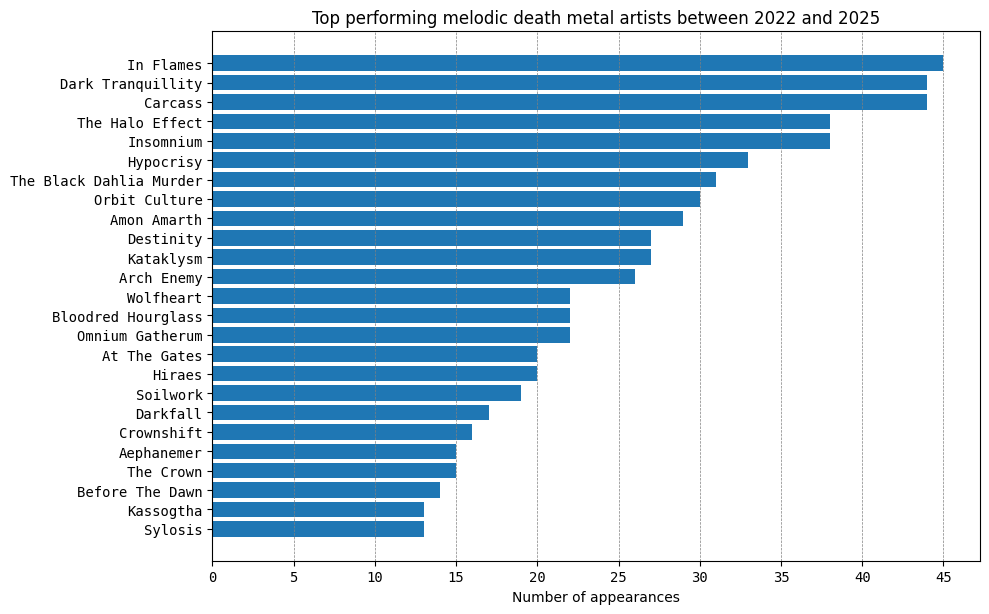
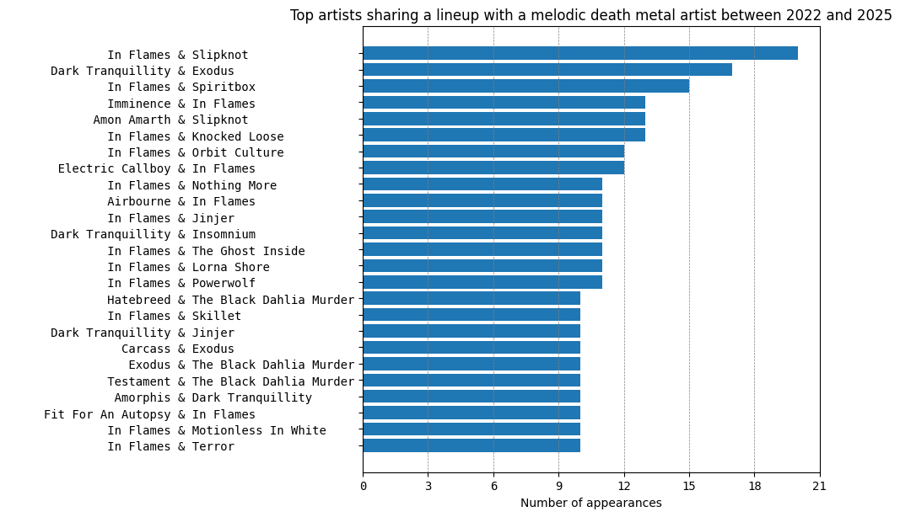
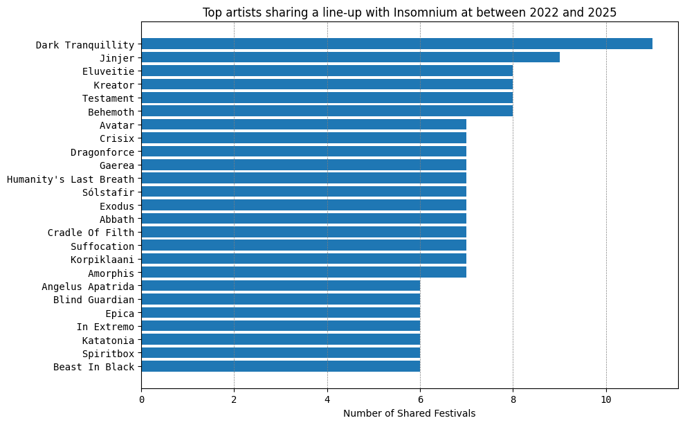
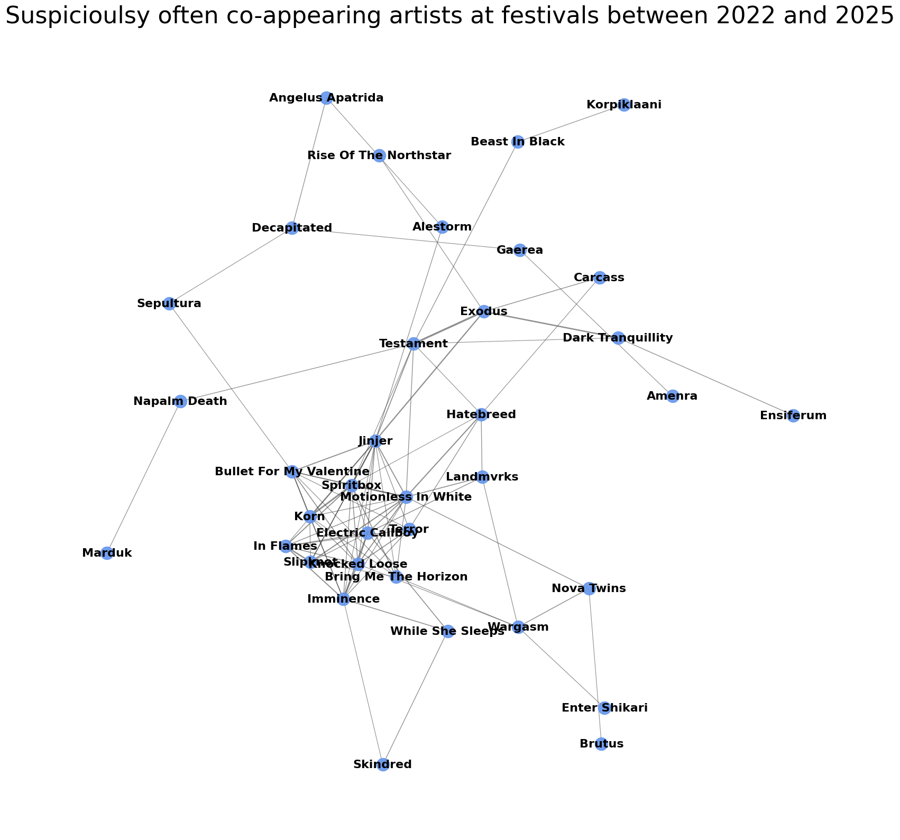
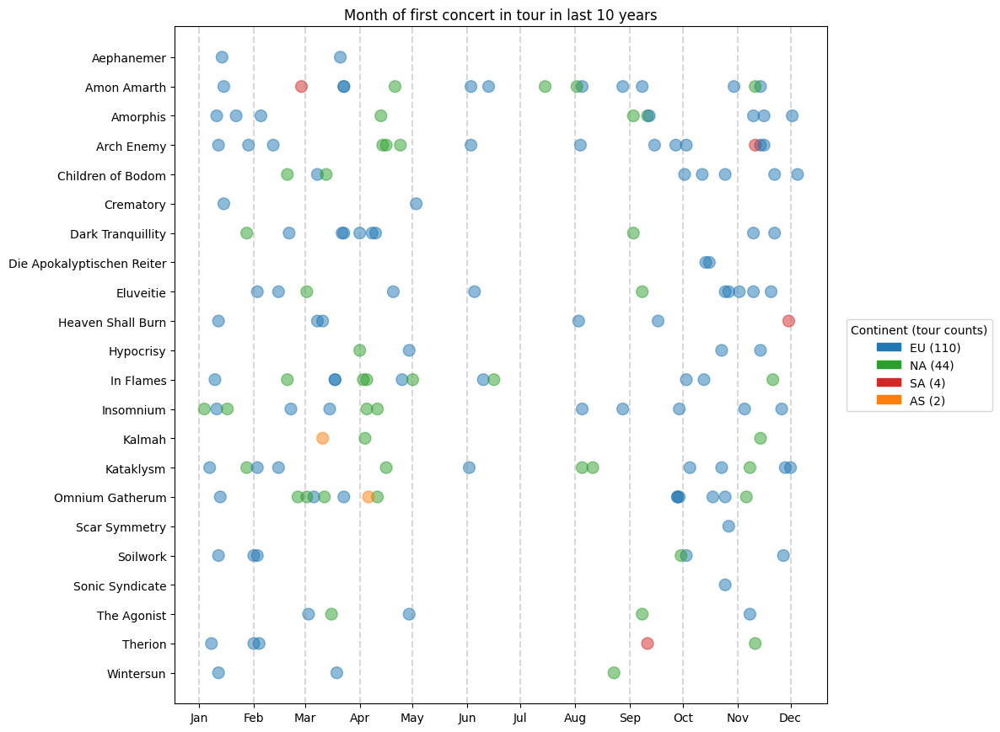

# Music analytics

Some analytics related to music, in particular on data related to artists themselves, but not really their songs.

This is mostly me playing around with data pertaining to something I really enjoy (my personal taste of music, metal of course 🤘) to build up a small portfolio of projects. My main personal learning goals with this portfolio is are to

1) acquire data through requests and scraping, without falling into the temptation of using third party wrappers,
2) visually display results and highlighting differences and similarities effictively and
3) gain some deeper understanding of the music I love.

Some projects are small and result in just a plot, whilst others gave the opportunity to analyse one dataset in multiple ways and even allowed some more in-depth analysis.

On the whole the results feel about right (according to my own intuition), though reducing the songs to metrics does not do justice to the artistry behind them, so do give some a little listen as well.

## Getting started

Clone the repo and install the requirements:

```bash
git clone https://github.com/vincentversluis/music_analytics.git
cd music_analytics
pip install -r requirements.txt
```

This project uses the friendly-for-data-analysts VS Code Jupyter code cells extension, so use this repo in VS Code and install the extension.

For dealing with requests to various end points, this repository uses a database to cache requests, to make things a bit faster and not hammer servers too much. To initialise the database, follow the instructions in [`data/databases/setup.py`](data/databases/setup.py).

### Querying endpoints

Functions query several endpoints, check out their definitions to figure out which ones. Typically the endpoints like one request per second, so the functions will sleep for a bit between requests to avoid hammering the server and causing 429 errors.

To get API keys for endpoints, you can use the following links:

- [Genius](https://docs.genius.com/)
- [Last.fm](https://www.last.fm/api/authentication)
- [Musicbrainz](https://musicbrainz.org/doc/MusicBrainz_API), though an API key is not required
- [Setlist.fm](https://api.setlist.fm/docs/1.0/index.html)
- [Spotify](https://developer.spotify.com/documentation/web-api), for a client ID and secret

When working through the scripts, you will find out where to put .txt files with the API keys.

### Other sources

Other sources of data for projects in this repository:

- [concerts-metal.com](https://en.concerts-metal.com/), which is scraped using `Selenium`
- [Encyclopaedia Metallum](https://www.metal-archives.com/), which is scraped using `Selenium`
- [Genius](https://genius.com/), which is also queried using endpoins, but also scraped using `requests` and `BeautifulSoup`

## Projects

All projects can be found in the [`projects`](projects) folder.

---

### [`compare_artist_followers_listeners`](projects/compare_artist_followers_listeners/)

Compare the number of [Spotify](https://open.spotify.com/us/) followers and listeners of artists performing at 70K tons of metal. This results in a scatterplot like this:



This shows that the festival (at the time of writing) has invited artists of varying popularity. The most popular artist (_Anthrax_) has a large following, though as there is a sizeable gap between their following and the next most popular artist (_Eluveitie_), this might leave room for yet another quite popular artist to be invited.

Other than allowing for just seeing the popularity of the artists, this might also give an idea of at which stage specific artists might be performing at, and at what time they might be performing.

---

### [`compare_genre_pushedness`](projects/compare_genre_pushedness/)

Compare how much [Spotify](https://open.spotify.com/us/) artists are pushed on Spotify. Pushedness is defined as the number of monthly listeners divided by the number of followers and can be seen as a measure of how well an artist is suggested by the Spotify suggestion algorithm. The hypothesis is that easier to listen genres like power metal are pushed more. Investigating this for the top rated artists of several genres, as found on [Last.fm](https://www.last.fm/), removing outliers and keeping only artists with at least 10,000 monthly listeners, the output is a scatterplot like this:



This illustrates that easier to listen to genres (and more currently popular genres) are indeed pushed somewhat more on Spotify than more _difficult to get_ genres. Interestingly the most listened to artists in the genres (such as _Metallica_ and _Bring Me The Horizon_) are not overly pushed. Amongst the lowest pushed artists are several well known bands in their genre (_Aggalloch_, _The Black Dahlia Murder_, _Sodom_), which leads to hypothesise that the algorithm does not necessarily help well known artists.

As a side note, Spotify does not provide an easy way to match an artist found on Last.fm, as it does not use a universal identifier such as MusicBrainzID (MBID). This means the artist has to be found by matching the name, which frequently results in incorrect matches. These have not been removed from the dataset, as it would be too time consuming to do so. Also scanning through which artists are associated with a specific genre, Last.fm seems to be not 100% reliable (_Ghost_ being called doom metal for example), possibly due to its crowdsourced nature.

---

### [`compare_lyrics`](projects/compare_lyrics/)

Compare the lyrics of songs by some of my current ~100 favourite artists, to investigate what characterises an artist's lyrics and which artists are lyrically close to each other. This uses data from [Genius](https://genius.com/) and results in several plots showing the top and bottom scoring artists for each metric, along with the distribution per metric. To create this I did remove some data points, such as non-English lyrics, so check out the [coding](projects/compare_lyrics/) for particulars.

---

A comparison per song for each artist results in this plot:



Lyrically doom metal (_Counting Hours_, _Saturnus_) seems to have shorter lyrics than melodic death metal (_Aether Realm_, _Shylmagoghnar_). At the same time, or perhaps as an effect, the doom metal (Ocean of Grief, _Mar de Grises_) vocabulary is more complex, as it uses more different words, whichs can be seen by the lexical diversity metric.

Though typically metal is thought of to have an negative sentiment (_Violent Work of Art_, _Slayer_), some bands actually have a definite average positive sentiment (_Fires in the Distance_, _Omnium Gatherum_).

---

A comparison aggregated per artist results in this plot:



Some artists' lyrical perspective (the use of pronoun _I_ (1.0) versus _we_ (0.0)) leans heavily towards the first person (_Der Weg einer Freiheit_, _White Zombie_). Likewise, some artists have a highly directed (the use of pronoun _you_) lyricism (_Carcass_, _Destinity_), whereas other do not at all (_Nephylim_, _Be'lakor_).

Emotionally, metal is usually assumed to be angry or sad, though some bands seem to distinguish themselves with relatively more joyful (_Omnium Gatherum_) and less angry (_Necrophagist_) or sad lyrics (_Fractal Gates_).

---

Using the above metrics, it is possible to find similar artists by lyrics. After applying [PCA](https://en.wikipedia.org/wiki/Principal_component_analysis) to the dataframe with lyrics metrics to acquire array `X` with an array of artists `artists`, this function finds the top N similar artists to _Insomnium_ lyrically:

```python
find_similar_artists_by_lyrics('Insomnium', X, artists, top_n=None)
```

resulting in this list of tuples with artists and their [Euclidean distance](https://en.wikipedia.org/wiki/Euclidean_distance) to lyrics of the melodic death metal band _Insomnium_:

```text
[('Mors Principium Est', 0.486),
 ('Swallow the Sun', 0.487),
 ('Wintersun', 0.505),
 ('Harakiri for the Sky', 0.544),
 ('Heaven Shall Burn', 0.559),
...
 ('Wiegedood', 3.325),
 ('Kanonenfieber', 3.361),
 ('Fires in the Distance', 3.367),
 ('Paysage d’Hiver', 3.518),
 ('Ellende', 3.54)]
```

This lists many melodic death metal (or adjacent bands) and feels about right when reading the lyrics of the found artists. Though the distance itself is meaningless, the difference in magnitude of the distance is demonstrated nicely when performing the same analysis for the more symphonic band _Aephanemer_:

```text
[('Harakiri for the Sky', 2.379),
 ('Edge of Sanity', 2.515),
 ('Heaven Shall Burn', 2.54),
 ('Soilwork', 2.54),
 ('Dark Tranquillity', 2.559),
...
 ('Karkaos', 4.116),
 ('Wiegedood', 4.169),
 ('Fires in the Distance', 4.225),
 ('Paysage d’Hiver', 4.28),
 ('Ellende', 4.3)]
```

_Aephanemer's_ lyrics are often inspired by specific mythology, whereas _Insomnium_ seems to get inspiration from a more general sense of darkness (they are Finnish, after all), sorrow and nature. This explains why the artists lyrically closest to _Aephanemer_ are still relatively distant (_Harakiri for the Sky_, 2.379) compared to _Insomnium's_ nearest neighbour (Finnish band _Mors Principium Est_, 0.486), with a similar inspirational profile.

---

### [`compare_platform_popularity`](projects/compare_platform_popularity/)

Compare the popularity of artists on music platforms [Last.fm](https://www.last.fm/) and [Spotify](https://open.spotify.com/us/) to see if one can be used as a proxy for the other. With a collection of several hundred pretty random artists in different genres, the output is a scatterplot like this:


This illustrates that the number of Spotify followers and Last.fm listeners is a reasonable proxy for artist popularity for different genres, though Spotify popularity is not as good a proxy for either of them. Note that the number of Spotify _listeners_ is not easily scraped and is therefore not included in this analysis.

---

### [`compare_platform_similarity`](projects/compare_platform_popularity/)

The music platforms [Last.fm](https://www.last.fm/) and [Encyclopaedia Metallum](https://www.metal-archives.com/) offer a feature which lists similar artists to a chosen artist. Last.fm appears to do this by analysing users' scrobbles, whilst Encyclopaedia Metallum uses crowdsourced suggestions. To see if the suggestions are consistent, this project compares the given suggestions for three artists of different fame, ranked by the platform's similarity score or suggestion count. The output is a scatterplot like this:



This illustrates that the different platforms seem to have consensus on the top similar artists, but beyond this, the ranking can differ significantly, with some descrepancies (_Aephanemer_ and _Ensiferum_).

---

### [`match_festivals`](projects/match_festivals/)

Analyse __metal__ festival data from [concerts-metal.com](https://en.concerts-metal.com/festivals.html) for __metal__ festivals held between 2022 and 2025 to find which festivals are a good match for a specific band, using [market basket analysis](https://en.wikipedia.org/wiki/Affinity_analysis). The result can be used by artists to find a good festival to aim to perform at.

Althouth the data is not complete, as concerts-metal.com is a crowdsourced website, this does list many festivals (also smaller ones) and on spot checks seems to pretty much always include the headliners.

---

Besides using the data for market basket analysis, let's visually inspect the scraped data first to see which artists performed at the same festivals:


This makes sense, as it shows many lineup sharing between artists that have been doing long festival seasons between 2022 and 2025.

---

Let's also filter for my favourite subgenre:



Besides possible disputes due to genre labeling (blame the source if you want to be like that), the usual suspects (_In Flames_, _Dark Tranquillity_, _Carcass_) are indeed the top performing melodic death metal bands at festivals.

---

In market basket analysis we are interested in items (bands) appearing in the same basket (festival lineup), so let's look at artists that share a lineup, with at least one of the bands being in the melodic death metal subgenre:



Although I expected more shared lineups between artists that are both in the melodic death metal subgenre (or adjacent), this typically seems to not be the case. The top lineup sharers are in the line of expectation, though, as _Slipknot_, _Exodus_ and _Spiritbox_ had long festival tours recently.

---

We can also look at the artists that share a lineup with a specific melodic death metal artist, for example _Insomnium_:



Although the top artist (_Dark Tranquillity_) shares the subgenre, the subgenres of other artists seems to be all over the place, though some are at least adjacent (_Eluveitie_, _Amorphis_) and have done club tours together.

---

A [market basket analysis](https://en.wikipedia.org/wiki/Affinity_analysis) gives a better idea of _statistically significant_ co-appearances at festivals, rather than just counting the number of times an artist appears at a festival. This is done through mining a set of association rules using `mlxtend`'s [fpgrowth](https://mlxtend.readthedocs.io/en/stable/generated/mlxtend.frequent_patterns.fpgrowth.html) and [association_rules](https://mlxtend.readthedocs.io/en/stable/generated/mlxtend.frequent_patterns.association_rules.html) functions. See the [the project's coding](projects/match_festivals/) for more details on the use of the `FestivalRecommender` class.

The coding is wraped into the `FestivalRecommender` class, which abstracts away the prep and mining steps to the simple function call `mine_rules(festivals)`, where festivals is a simple dict with the lineups of each festival. The call `recommend_festivals('The Halo Effect')` returns a similarity score per festival for the band _The Halo Effect_, based on the mined rules. The scores with an input of festivals between 2022 and 2025 look like this:

```text
Alcatraz Metal Festival: 9.25
Resurrection Fest: 6.00
Sun And Thunder Festival: 6.00
Hellfest: 5.50
Mystic Festival: 5.25
Bloodstock Open Air: 5.00
Bangers Open Air: 5.00
South of Heaven Open Air: 5.00
Headbangers' Weekend: 5.00
Dynamo Metal Fest: 4.50
```

These represent festivals _The Halo Effect_ has __not__ yet played at, but artists that have played on the same festival as _The Halo Effect_ have. A higher score means more co-appearing artists at other festivals have appeared at the same festival, so _The Halo Effect_ would be a good fit for the festival, based on that fact. Note that this only includes data from 2022 to 2025, so the artist might have performed at the suggested festival before that.

---

Using the mined rules for co-appearances, we can also look at which artists could be _expected_ to appear at the same festivals and have done so very frequent, possibly resulting in a statistically significant network of overlapping artists. The `plot_similarity_graph` function does this by calculating the [Jaccard similarity](https://en.wikipedia.org/wiki/Jaccard_index) between the top N most performing artists and plotting a graph like this:



Artists in the top N that result in isolated nodes are removed from the graph.

Although this does not really feature many of the artists I am musically interested in, the plot does show that the mined rules make sense, as links hinted at in the matrix above are present, many of the artists are headliners and the biggest names are in the centre of the network.

Interestingly (to me at least), pretty much all edges are connecting artists in different subgenres, which confirms that festivals attempt to book headliners from different subgenres, to accommodate for different tastes and draw a relatively diverse crowd.

---

In the same vein, it is possible to just find the artists that appear at the same festivals as a given artist. Calling `find_coappearing_artists('Hiraes')` gives:

```text
[('Destruction', 0.065),
 ('Benediction', 0.061),
 ('Gloryhammer', 0.056),
 ('Phil Campbell & The Bastard Sons', 0.048),
 ('Gutalax', 0.038),
 ('Finntroll', 0.038),
 ('Feuerschwanz', 0.038),
 ('Kanonenfieber', 0.038),
 ('Lacuna Coil', 0.037),
 ('Rotting Christ', 0.035)
...
```

Which shows the artist and their Jaccard similarity score to _Hiraes_ based on the festivals they made a co-appearence at, which seems correct, looking at their festival history.

---

### [`predict_releases`](projects/predict_releases/predict_releases.py)

Visualise [musicbrainz](https://musicbrainz.org/) data to visualise when albums were released and when to expect the next one, based on some simple metrics:


This can be used to get hyped up about upcoming releases (_Insomnium_!) or temper expectations (_Wintersun_). On spot checking announced release dates, this seems to work reasonably well.

---

### [`visualise_similar_artists`](projects/visualise_similar_artists/visualise_similar_artists.py)

Visualise [Last.fm](https://www.last.fm/) data to compare the popularity of similar artists to produce a graph like this:


This can be used to find new artists to listen to (_Brymir_!). Though I am unsure how Last.fm's similarity score is calculated, it feels about right.

---

### [`visualise_tours`](projects/visualise_tours/)

Visualise [concerts-metal.com](https://en.concerts-metal.com/) data to get an idea of what time of year tours start for various bands, resulting in something like:



This gives an idea of when bands start a new tour in a specific part of the world over the last 10 years. Though most of the activity seems to be in Europe and the US, it looks like the first date of a tour is pretty much all over the place, with the visually recognisable exception of the festival season (May-ish to August), where not many tours start.

## Contributing

This is a project to showcase some of my skills in data analysis, so contributions cannot be accepted, but feel free to fork and ask questions.
