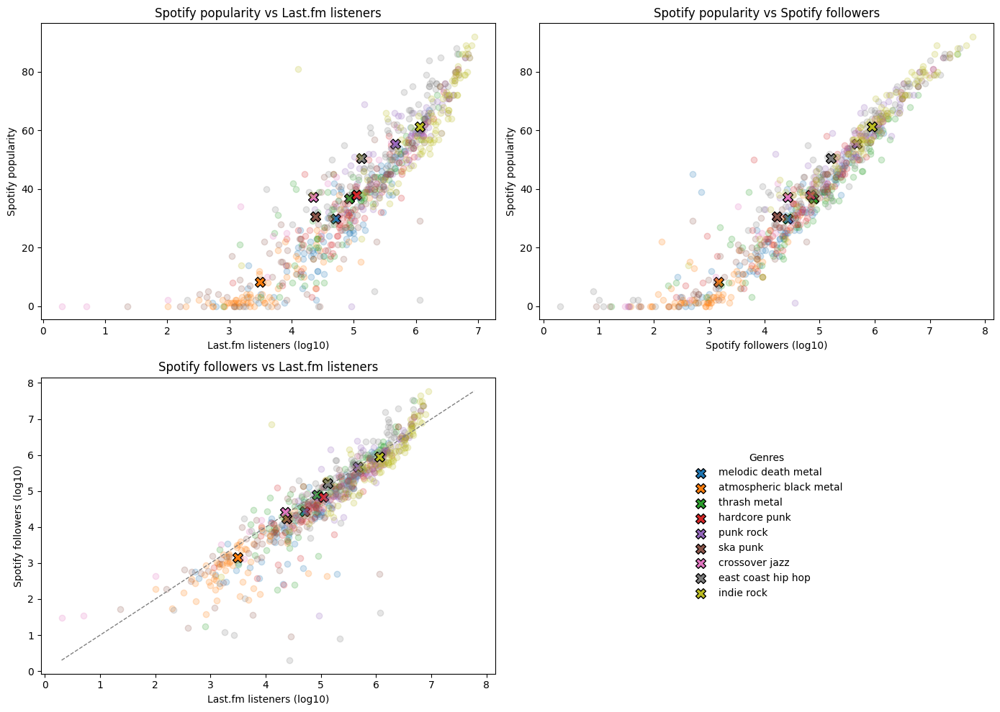
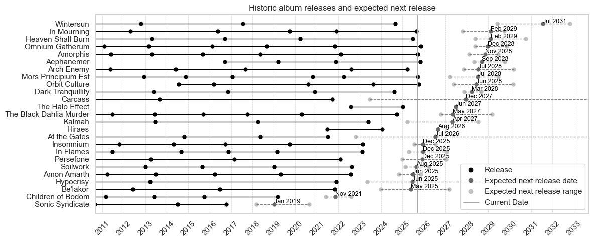
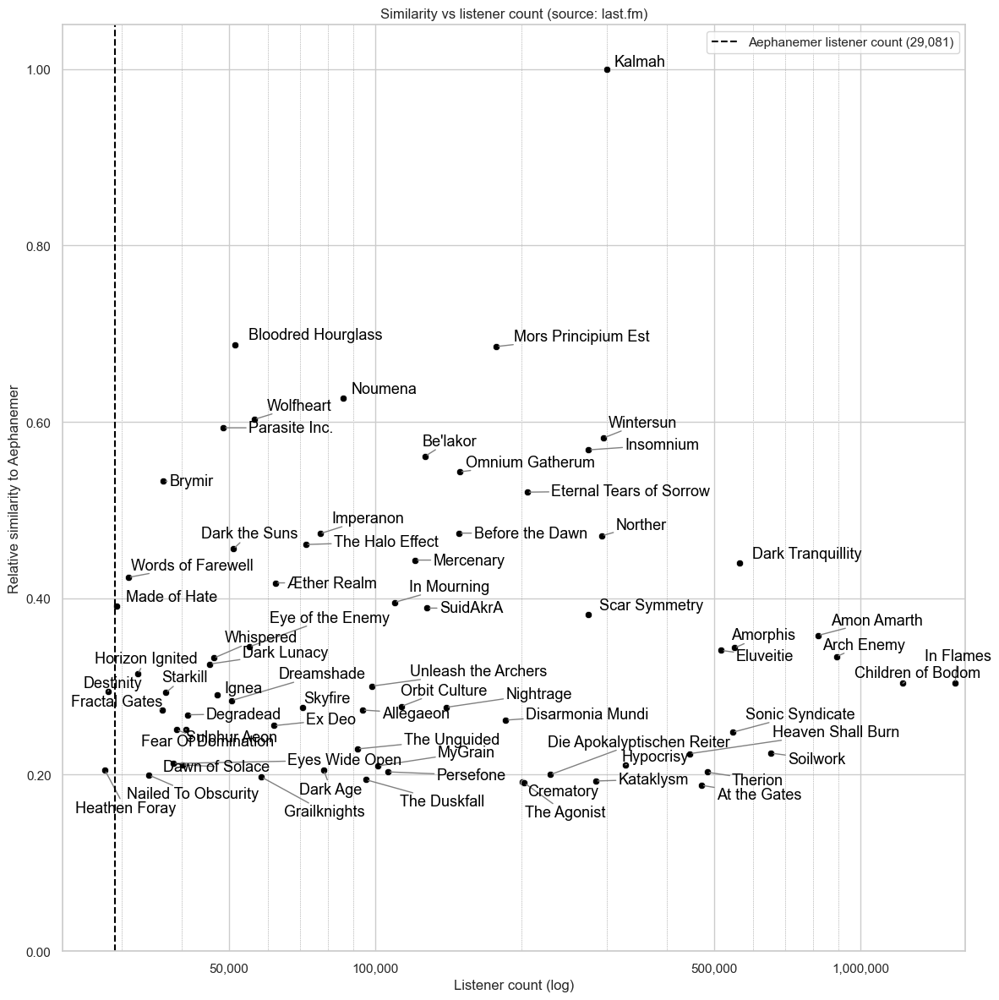

# Music analytics

Some analytics related to music.

## Getting started

Clone the repo and install the requirements:

```bash
git clone https://github.com/vincentversluis/music_analytics.git
cd music_analytics
pip install -r requirements.txt
```

This project uses the friendly-for-data-analysts VS Code Jupyter code cells extension, so use this repo in VS Code and install the extension.

For dealing with requests to various end points, this repository uses a database to cache requests, to make things a bit faster and not hammer servers too much. To initialise the database, follow the instructions in [`data/databases/setup.py`](data/databases/setup.py).

### Querying endpoints

Functions query several endpoints, check out their definitions to figure out which ones. Typically the endpoints like one request per second, so the functions will sleep for a bit between requests to avoid hammering the server and causing 429 errors.

To get API keys for endpoints, you can use the following links:

- Last.fm: https://www.last.fm/api/authentication
- Musicbrainz: https://musicbrainz.org/doc/MusicBrainz_API, though an API key is not required
- Spotify: https://developer.spotify.com/documentation/web-api, for a client ID and secret

When working through the scripts, you will find out where to put .txt files with the API keys.

## Projects

All projects are in the [`projects`](projects) folder.

### [`compare_platform_popularity`](projects/compare_platform_popularity/compare_platform_popularity.py)

Compare the popularity of artists on music platforms [Last.fm](https://www.last.fm/) and [Spotify](https://open.spotify.com/us/) to see if one can be used as a proxy for the other. The output is a scatterplot like this:



This illustrates that the number of Spotify followers and Last.fm listeners is a reasonable proxy for artist popularity for different genres, though Spotify popularity is not as good a proxy for either of them. Note that the number of Spotify _listeners_ is not easily scraped and is therefore not included in this analysis.

---

### [`predict_releases`](projects/predict_releases/predict_releases.py)

Visualise [musicbrainz](https://musicbrainz.org/) data to visualise when albums were released and when to expect the next one, based on some simple metrics:



This can be used to get hyped up about upcoming releases. On spot checking announced release dates, this seems to work reasonably well.

---

### [`visualise_similar_artists`](projects/visualise_similar_artists/visualise_similar_artists.py)

Visualise [Last.fm](https://www.last.fm/) data to compare the popularity of similar artists to produce a graph like this:



This can be used to find artists to listen to. Though I am unsure how Last.fm's similarity score is calculated, it feels about right.

---

### [`visualise_tours`](projects/visualise_tours/visualise_tours.py)

Visualise [setlist.fm](https://setlist.fm/) data to get an idea of what time of year tours start, resulting in something like:

...

---

## Contributing

Contributions are welcome! Feel free to open an issue or pull request.
